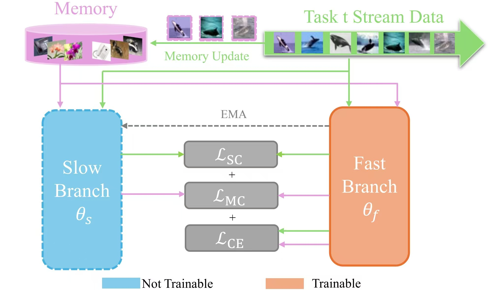

# Balancing Plasticity and Stability via Dual-Branch Learning in Online Continual Learning
Official implementation of WWW2025 short paper: "Balancing Plasticity and Stability via Dual-Branch Learning in  Online Continual Learning"

  

---
## Abstract  
Deep learning models often face catastrophic forgetting when learning new tasks while retaining prior knowledge. In continual learning (CL), balancing plasticity (adapting to new information) and stability (preserving past knowledge) is crucial. Memory replay addresses this challenge by integrating new data with stored memories, but existing methods often fail to achieve an effective balance, overemphasizing either old or new knowledge. Previous works address this issue by enhancing replay buffer quality with distilled images but overlook the model's learning process itself.To tackle this, we propose a novel dual-branch framework designed to manage the plasticity-stability trade-off in CL. The fast-updated branch enhances plasticity by quickly adapting to novel tasks,while the slow-updated branch ensures stability by gradually consolidating knowledge across all seen tasks without gradient updates. To further stabilize the learning process, we introduce a consistency loss to align the two branches and prevent divergence. This dual-branch structure integrates new information while maintaining robust retention of prior knowledge.Extensive experiments on challenging online continual learning benchmarks validate the effectiveness of our framework, demonstrating superior performance and robust handling of the plasticity-stability trade-off.

---
## Datasets  

### Online Class Incremental  
- **CIFAR100**  
- **Mini-ImageNet**  
- **Tiny-ImageNet**  

### Data Preparation  
- **CIFAR10 & CIFAR100**: These datasets will be automatically downloaded during the first run.  
- **Mini-ImageNet**: Download from [Mini-ImageNet Kaggle Dataset](https://www.kaggle.com/whitemoon/miniimagenet/download) and place it in `datasets/mini_imagenet/`.  
- **Tiny-ImageNet**: Download from [Tiny-ImageNet](http://cs231n.stanford.edu/tiny-imagenet-200.zip), place it in `datasets/tiny-imagenet-200/`. Then, copy `process_tiny_imagenet.py` to the directory and run it to preprocess the dataset into pickles.

---


## Experimental Setup  


| **Datasets**        | **Memory Size** | **Learning Rate** | **Momentum** | **Stream Data Consistency Term λ** | **Memory Data Consistency Term μ** | **Accuracy** | **Parameters**                                                         |
|---------------------|-----------------|-------------------|--------------|-------------------------------------|------------------------------------|--------------|------------------------------------------------------------------------|
| CIFAR100            | 100             | 0.05              | 0.998        | 0.5                                 | 0.1                                | 17.9±0.4        | [cifar_100](https://pan.baidu.com/s/1e_1g_tsEL81CEwMidpMgXA?pwd=nrcw)                                     |
| CIFAR100            | 200             | 0.05              | 0.998        | 0.5                                 | 0.1                                | 20.7±0.4        | [cifar_200](https://pan.baidu.com/s/1jnlE6Ys1r4xt4R0bbqPyZg?pwd=dq6q)                                     |
| CIFAR100            | 500             | 0.05              | 0.998        | 0.5                                 | 0.1                                | 23.9±0.3        | [cifar_500](https://pan.baidu.com/s/1kKB6DZxZFIV2gcrPXPDhjg?pwd=2fas)                                     |
| Mini-ImageNet       | 100             | 0.05              | 0.999        | 0.5                                 | 0.1                                |  17.4±0.4        | [mini_100](https://pan.baidu.com/s/1OH5xx-qH6fEri9smeGBUNg?pwd=rgkt)   |
| Mini-ImageNet       | 200             | 0.05              | 0.999        | 0.5                                 | 0.1                                | 20.3±0.4        | [mini_200](https://pan.baidu.com/s/1R3jeFWZWK56VfY53QTMNzA?pwd=34k4 )  |
| Mini-ImageNet       | 500             | 0.05              | 0.9985       | 0.5                                 | 0.1                                |  24.2±0.7        | [mini_500](https://pan.baidu.com/s/1rbsI3MqZoSr1sNMs5HrJvQ?pwd=8eex)   |
| Tiny-ImageNet       | 200             | 0.05              | 0.999        | 0.5                                 | 0.1                                | 8.8±0.2        | [tiny_200](https://pan.baidu.com/s/1ozdY-iZYYVG0j0nStGY46w?pwd=d8q9)   |
| Tiny-ImageNet       | 400             | 0.05              | 0.999        | 0.5                                 | 0.1                                | 9.6±0.4        | [tiny_400](https://pan.baidu.com/s/1zYzAS38UbrdVFEfauqSUeA?pwd=fuq7)   |
| Tiny-ImageNet       | 1000            | 0.05              | 0.9985       | 0.5                                 | 0.1                                | 10.2±0.5        | [tiny_1000](https://pan.baidu.com/s/1y8qsqakbfqJuO8l_H716QA?pwd=g59a ) |

---


## Run Commands  
For detailed descriptions of options, refer to the `general_main.py`.

**Sample Command to Run Algorithms on Split-CIFAR100**:  
```bash
python general_main.py --data cifar100 --cl_type nc --agent BPS --retrieve random --update random --mem_size 100 --images_per_class 1 --eps_mem_batch 100  --momentum_m 0.998 --batch_cons_weight 0.5 --buffer_cons_weight 0.1
```
---

## Acknowledgement
This project is mainly based on [online-continual-learning](https://github.com/RaptorMai/online-continual-learning).
We also appreciate the contributions of all the developers and researchers who made this work possible.

## Citation
If you find our work useful, please consider citing our paper:

```
@inproceedings{
BPS2025,
title={Balancing Plasticity and Stability via Dual-Branch Learning in Online Continual Learning},
author={Xu Han, Haodong Lu, Huiyi Wang and Dong Gong},
booktitle={Companion Proceedings of the ACM Web Conference 2025},
year={2025},
url={https://doi.org/10.1145/3701716.3715590}
}
```
